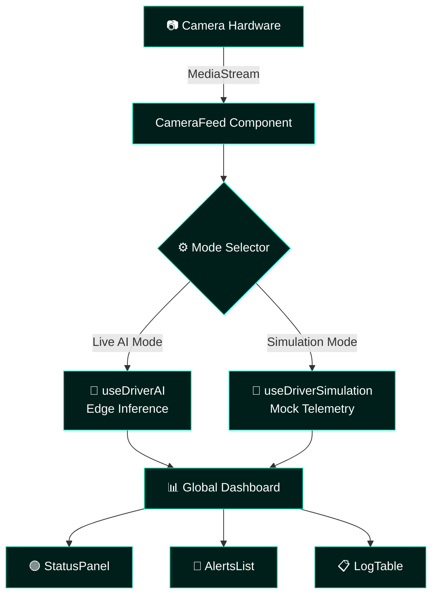

<div align="center">


<br/>

<p align="center">
  
</p>

<br/>

<p align="center">
  
  &nbsp;
  
  &nbsp;
  
  &nbsp;
  
</p>

<p align="center">
  
  
  
  
  
</p>

</div>

---

```
> INITIALIZING DR SAFETY MONITOR...
> CAMERA FEED............ [CONNECTED]
> AI INFERENCE ENGINE.... [ARMED]
> ALERT SYSTEM.......... [ACTIVE]
> PRIVACY GUARD......... [ENFORCED]
> STATUS: ALL SYSTEMS OPERATIONAL
```

---

## Overview

DR Safety is a **real-time, privacy-first driver monitoring platform** — built for environments where a single lapse of attention can be fatal.

It feeds live camera streams through an on-device AI pipeline to detect distraction, drowsiness, and posture shifts the moment they happen. Audio and visual alerts fire instantly. No frames are transmitted. No data leaves the machine.

Designed for **fleet operators, automotive OEMs, road safety agencies**, and researchers who need full observability without trading driver privacy for it.

```
Camera Hardware ──▶ CameraFeed ──▶ Mode Selector ──┬──▶ useDriverAI  (Live Inference)
                                                    └──▶ useDriverSimulation (Mock)
                                                              │
                                                    Global Dashboard
                                              ┌──────────────┼──────────────┐
                                              ▼              ▼              ▼
                                         StatusPanel    AlertsList      LogTable
```

---

## Core Modules

<table>
<tr>
<td width="50%">

### 📡 Real-Time Camera Feed
```
Component : <CameraFeed />
API       : MediaStream (hardware-direct)
Latency   : Optimized per-frame
Fallback  : Graceful permission errors
```
Low-latency video capture piped directly into the AI inference layer with no intermediate buffering.

</td>
<td width="50%">

### ⚙️ Dual-Mode AI Engine
```
LIVE MODE : useDriverAI hook
           → real edge inference

SIM MODE  : useDriverSimulation hook
           → mock telemetry stream
```
Switch modes without restarting. Built for QA, demos, and edge-case testing without hardware.

</td>
</tr>
<tr>
<td width="50%">

### 🔊 Active Alert System
```
Trigger Types:
  ├── Micro-sleep    → CRITICAL
  ├── Phone usage    → CRITICAL
  ├── Gaze deviation → HIGH
  ├── Posture shift  → MEDIUM
  └── Drowsiness     → CRITICAL

Output: Audio (HTML5) + <AlertsList />
```

</td>
<td width="50%">

### 📊 Telemetry Dashboard
```
<Dashboard />   → unified session shell
<StatusPanel /> → live health metrics
<LogTable />    → full historical log
<AlertsList />  → active event queue
```
Single pane of glass for the entire driver session — real-time and historical.

</td>
</tr>
</table>

---

## System Architecture



---

## Detection Matrix

| Event | Severity | Trigger Condition | System Response |
|-------|----------|-------------------|----------------|
| 😴 **Micro-sleep** | `CRITICAL` | Eyes closed > threshold ms | Audio alarm + alert |
| 📱 **Phone usage** | `CRITICAL` | Hand-to-face proximity | Immediate alert |
| 👀 **Gaze deviation** | `HIGH` | Eyes off-road > 2s | Visual warning |
| 🪑 **Posture shift** | `MEDIUM` | Head/shoulder offset | Log entry + soft alert |
| 😵 **Drowsiness** | `CRITICAL` | PERCLOS score > 80% | Audio + visual alarm |

---

## Project Structure

```
face-recognition/
│
├── 📁 src/
│   ├── 📁 assets/                    # Static media & SVG icons
│   │
│   ├── 📁 components/
│   │   ├── AlertsList.tsx            # Real-time event notification queue
│   │   ├── CameraFeed.tsx            # Video stream handler
│   │   ├── Dashboard.tsx             # Main layout wrapper
│   │   ├── LogTable.tsx              # Historical session log
│   │   ├── ModeSelector.tsx          # Live AI ↔ Simulation toggle
│   │   ├── PrivacyPolicy.tsx         # Edge-processing disclosure
│   │   └── StatusPanel.tsx           # Quick-glance health metrics
│   │
│   ├── 📁 hooks/
│   │   ├── useDriverAI.ts            # Edge AI inference interface
│   │   └── useDriverSimulation.ts    # Mock telemetry generator
│   │
│   ├── 📁 utils/
│   │   └── audio.ts                  # Warning chime & HTML5 audio handlers
│   │
│   ├── App.tsx                       # Root application router
│   └── main.tsx                      # React DOM entry point
│
├── tailwind.config.js
├── vite.config.ts
└── package.json
```

---

## Getting Started

> **Prerequisites:** Node.js v18+ (v20 recommended) · Working webcam for live AI mode

### Boot Sequence

```bash
# 01 — Clone
git clone https://github.com/FOX-KNIGHT/face-recognition.git
cd face-recognition

# 02 — Install
npm install

# 03 — Launch
npm run dev
# → http://localhost:5173
```

> Grant camera permissions when prompted. Live AI mode requires active webcam access.

### No Camera? Use Simulation Mode

```
1. Open http://localhost:5173
2. Toggle Mode Selector → SIMULATION
3. Mock telemetry drives all components
   — alerts, logs, status panel —
   with zero hardware required.
```

---

## Module Reference

**`<ModeSelector />`**
Switches the data pipeline between physical camera AI loop and the internal simulation engine. Essential for testing UI states and alert flows without triggering real driver events.

**`<PrivacyPolicy />`**
User-facing disclosure of edge-only processing. All video inference runs locally — no frames, snapshots, or metadata are ever transmitted.

**`audio.ts`**
Binds AI trigger states to the HTML5 Audio API. A `CRITICAL_DROWSINESS` event fires an immediate audible alarm — designed to work even when the driver isn't looking at the screen.

---

## Roadmap

- [x] Real-time camera feed integration
- [x] Dual-mode: Live AI + Simulation engine
- [x] Active alert system with audio warnings
- [x] Telemetry dashboard with session logs
- [x] Privacy-first edge-only processing
- [ ] Multi-camera support — cabin + road view
- [ ] Per-driver PERCLOS calibration profiles
- [ ] Session export — CSV / PDF safety reports
- [ ] Mobile companion app (React Native)
- [ ] Fleet management multi-driver command view

---

## Author

<p align="center">
  <a href="https://github.com/FOX-KNIGHT">
    
  </a>
  &nbsp;
  <a href="https://www.linkedin.com/in/siddhant-jena-457350389">
    
  </a>
  &nbsp;
  <a href="mailto:worksiddhant18@gmail.com">
    
  </a>
</p>

---

<div align="center">

```
> SESSION ENDED
> DRIVER SAFETY SCORE: MONITORED
> DATA RETAINED: NONE
> STATUS: [SAFE]
```


</div>
